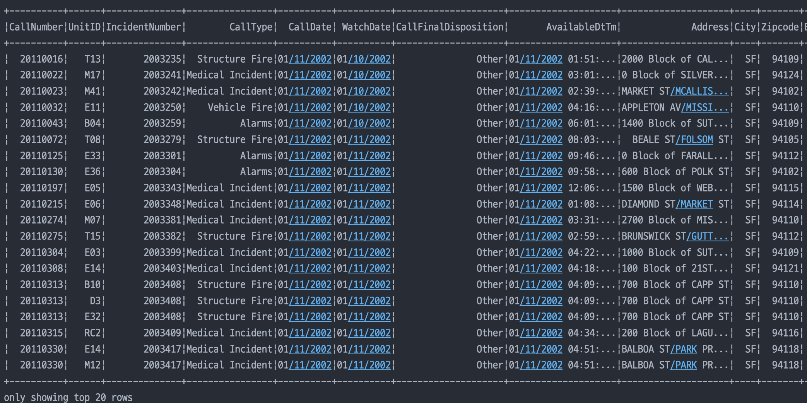
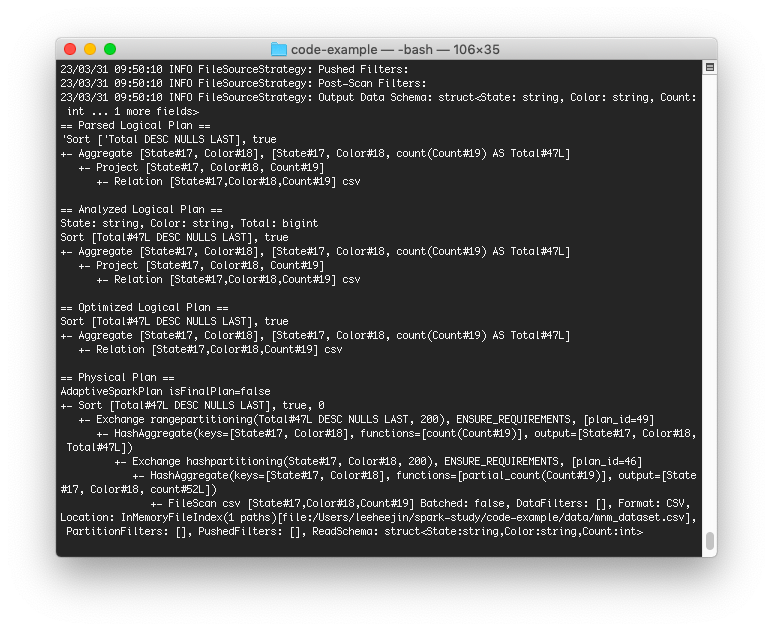

# 3장 Apache Spark’s Structured APIs
이 장에서는 Apache Spark가 어떻게 생겨났고, Spark의 버전들의 특성을 간략하게 소개하고 있다. 그리고 새로운 API를 살펴보기 전에 RDD API 모델을 살펴보겠다.   

## 1. Spark: What’s Underneath an RDD?

RDD는 스파크에서 가장 기초적인 추상화이고, RDD에는 3가지의 중요한 특성이 있다   

1. 종속성 (Dependencies)   
2. 파티션 (Partitions)   
3. 계산 기능 (Compute function) => Iterator[T]   
- Iterator 관련 자료   
[https://onlyfor-me-blog.tistory.com/319](https://onlyfor-me-blog.tistory.com/319)   

3가지 모두 간단한 RDD 프로그래밍 API 모델에 필수적이다.   

### 종속성 

스파크에 입력으로 RDD를 구성하는 방법을 **지시하는 종속성 목록이 필요**하다.
결과를 재현하기 위해 필요한 경우 Spark는 이러한 종속성에서 RDD를 재생성하고 RDD에 대한 작업을 복제할 수 있습니다. (이러한 특징은 RDD의 탄력성을 부여한다)

### 파티션 

파티션은 Spark에 **작업을 분할**하여 실행자 간에 파티션의 계산을 **병렬화** 할 수 있는 기능을 제공한다. 스파크는 로컬리티 정보를 사용하여 데이터에 가까운 실행자에게 작업을 보낸다.
그렇게 하면 네트워크를 통해 전송되는 데이터가 줄어든다.

### 계산 기능

RDD 계산 기능은 RDD에 **데이터가 저장될 수 있도록 Iterator 기능을 제공**한다.

이런 RDD에 몇 가지 문제점이 있는데,

- 계산 기능이 불명확하다 (Spark는 오직 lambda 표현만 본다)
- Iterator[T] 데이터 타입 또한 불명확하다 (Spark는 Python에 있는 일반 개체라는 것만 안다)
- 의도를 전혀 이해하지 못한다
- Spark는 T에 있는 특정 데이터 타입의 지식이 없다 (특정 column 개체 접근 할 수 없음)

⇒ 이러한 불투명성은 Spark가 효율적인 query문을 작성하는데 방해가 된다.

## 2. Structuring Spark

- Clarity and Simplicity (명료함과 단순성)
    Spark 2.x는 Spark를 구성하는 몇 개의 key 스키마로 소개되는데, 데이터 분석에서 패턴을 사용하면서 발견되는 계산은 filtering, selecting, counting.. 과같은 high level 작업으로 표현된다. 

- Specificity (구체성)

    DSL 연산 세트를 통하여, Spark's에 제공된 언어(Java, Python, Spark, R, and SQL)에서 API를 사용 가능하게 된다.

    이 연산자를 사용하면 Spark에 데이터로 무엇을 계산하고 싶은지 알릴 수 있으며, 결과적으로 실행을 위한 효율적인 쿼리를 구성할 수 있다.

    명령과 구조의 마지막 스키마는 데이터가 SQL 테이블이나 스프레드시트 같은 형식으로 정렬될 수 있도록 해준다.

## 3. Key Merits and Benefits

- Structure는 스파크 구성 요소 전반에 걸쳐 향상된 성능과 공간 효율성을 포함한 여러 가지 이점을 제공한다 (표현성, 단순성, 구성성 및 일관성)
- 표현성과 구성성이 있는 코드 (각 이름에 대한 모든 연령을 다음 기준으로 집계)
⇒  스파크에게 일련의 **람다 함수**를 사용하여 키를 집계하고 평균을 계산하는 방법이 **암호화**되어 있고 **읽기 어렵다.**
- 표현력이 뛰어나고 단순한 코드: 높은 수준의 DSL 연산자와 DataFrame API를 사용하여 동일한 쿼리를 표현한 코드)


### 고수준 DSL연산자들과 데이터프레임 API를 쓴다면?

- 스파크에게 **무엇을 할지** 알려주므로 표현력이 높으며 간단하다.
- 스파크는 이런 쿼리를 파악해 사용자의 의도를 이해할 수 있기에 연삭 최적화가 가능하다.
- 스파크 상위 수준 API는 컴포넌트들과 언어를 통틀어 일관성을 갖는다.
- 이러한 단순성이나 표현력을 상위 수준 구조화 API 위에 구축된 스파크 SQL 엔진 덕택에 가능한 것이다.
- 추후 스파크 SQL 엔진에 대해 살펴볼 예정이다.(해당 과정에서는 자주 쓰이는 연산을 위한 API와 DSL이 분석에 어떻게 쓰이는지 살펴본다.)


### 데이터 프레임 API

- 스파크 데이터프레임
    - 구조, 포맷 등 특정 연산 등에 있어 판다스 데이터 프레임의 영향을 받았다.
    - 이름 있는 컬럼과 스키마를 가진 분산 인메모리 테이블처럼 동작한다.
    - integer, string, array, real, data, timestamp 등의 데이터 타입을 가질 수 있다.
   

### 스파크의 기본 데이터 타입

- 스파크는 지원 프로그래밍 언어에 맞게 기본적인 내부 데이터 타입을 지원한다.
    - ex. In 스칼라, 어떤 컬럼 이름이 String, Byte 등 타입 중 하나가 되도록 선언할 수 있다.

스파크의 파이썬 정형화 데이터 타입

| 데이터타입 | 스칼라에서 할당되는 값 | 초기 생성 API |
| --- | --- | --- |
| BinaryType | bytearry | BinaryType() |
| TimestampType | datatime.datatime | TimestampType() |
| DataType | datatime.data | Datatype() |
| ArrayType | list,tuple,array 중 | ArrayType(datatype,[nullable]) |
| MapType | dict | MapType(keyType, valueType, [nullable]) |
| StructType | list 혹은 tuple | StructType([fileds]) |
| StructField | 해당 필드와 맞는 값의 타입 | StructField(name,dataType,[nullable]) |


### 스파크에서의 스키마 
데이터 프레임을 위해 칼럼이름 과 연관된 데이터 타입을 정의한 것으로 외부 데이터 소스에서 구조화된 데이터를 읽어 들일 때 쓰이게 된다.

스키마를 정의하는 방법에는 두 가지가 있다.

1. 프로그래밍 스타일

```python
schema=StructType([StructField("author",StringType(),False),
StructField("title",StringType(),False),
StructField("pages",IntegerType(),False)])
```

2. DDL

(예제 schema_DDL 코드 참고)


### 칼럼과 표현식

**칼럼**

- 어떤 특정한 타입의 필드를 나타내는 개념
    - 개념적으로 판다스나 R에서의 데이터 프레임이나 RDBMS 테이블의 칼럼과 유사
- 사용자는 이름으로 칼럼을 나열해 볼 수도 있고, 관계형 표현이나 계산식 형태의 표현식으로 그 값들에 연산을 수행할 수 있음
- public 메소드를 가진 객체로 표현 (`칼럼` 타입)
- 논리식이나 수학 표현식도 사용 가능
    - `expr(”columnName * 5”)` (`columnName`이 `integer`, `string` 등의 타입일 경우)
    - `(expr(”columnName - 5”) > col(anothercolumnName))`
- Column 객체는 단독으로 존재할 수 없음 → 각 칼럼은 한 레코드의 로우의 일부분이며, 모든 로우가 합쳐져서 하나의 데이터 프레임을 구성


**로우**

하나의 행은 하나 이상의 동일한 타입 or 다른 타입의 칼럼을 갖고 있는 로우(row) 객체로 표현되며 인덱스는 0부터 시작한다.
Row 객체들은 빠른 탐색을 위해 데이터프레임으로 만들어서 사용되기도 한다. 데이터 프레임을 읽어들이는게 더 일반적이며 스키마를 이용하는 것이 데이터 프레임 작성에 더 빠르고 효율적이다.


## 자주 쓰이는 데이터 프레임 작업들

**DataFrameReader**
-> JSON, CSV, 파케이(Parquet), 텍스트, 에이브로, ORC 등의 포멧을 데이터 소스에서 데이터 프레임으로 가지고 온다.

**DataFrameWriter**
-> 동일하게 특정 포멧의 데이터 소스에서 데이터프레임으로 써서 내보낸다.

### DataFrameReader와 DataFrameWriter 사용하기

고수준의 추상화 및 NoSQL, RDBMS, 아파치 카프카, 키네시스 등의 커뮤니티의 공헌으로 스파크에서 읽고 쓰는 작업은 쉬운편이다.

큰 데이터 프레임은 스키마를 지정하고 DataFrameReader 클래스를 통해서 읽는것이 효과적이다.

예제 dataframe.py 코드와 결과를 살펴보자.


spark.read.csv() 함수는 CSV파일을 읽어서 row객체와 스키마에 맞는 타입의 이름이 있는 칼럼들로 이루어진 데이터 프레임으로 되돌려준다.

DataFrameWriter으로 원하는 포맷으로 쓸 수 있으며, 기본 포멧은 파케이고 스내피로 압축한다. 만약 파케이로 쓰였다면 스키마는 파케이 메타데이터의 일부로 보존이 가능하며 수동으로 스키마를 적용할 필요가 없어진다.


## 데이터세트

- 대용량 데이터를 처리할때 스키마추론은 품이 많이 들기때문에 미리 해당 스키마를 알아야한다.
- 데이터세트 만들때 스키마를 저장하는 방법은 케이스클래스(case class)를 사용하는 것이다.

1. 스칼라’s 케이스 클래스 
    - 아래와 같이, JSON 엔트리를 특화객체(DeviceIoTData)로 만들기 위해 스칼라 케이스 클래스를 정의할 수 있다.
    
    [JSON 문자열]
    
    ```json
    {"device_id": 198164, "device_name": "sensor-pad-198164owomcJZ", "ip": "80.55.20.25 ,
    "cca2": "PL", "cca3": "POL", "cn": "Poland", "latitude": 53.080000, "longitude": 18.62000,
    "scale": "Celsius", "temp": 21, "'humidity": 65, "battery_level": 8, "c02_level": 1408, "Ic
    "red", "timestamp" :1458081226051}
    ```
    
    [케이스 클래스]
    
    ```scala
    case class DeviceIoTData (battery_level: Long, cO2_Level: Long, cca2: String, cca3: String, cn: String, device_id: Long, device_name: String, humidity: Long, ip: String, latitude:
    Double, lcd: String, longitude: Double, scale:String, temp: Long, timestamp: Long)
    ```
    
    - 케이스 클래스를 정의한 후에는 파일을 읽어서 Dataset[Row] → Dataset[DeviceIoTData]로 바꾸는 데 사용 가능하다.
    
    ```scala
    //스칼라 예제
    val ds = spark.read
    	.json("/databricks-datasets/learning-spark-v2/iot-devices/iot_devices-json")
    	.as[DeviceloTData]
    ds: org.apache.spark.sql.Dataset[DeviceIoTData] = [battery_level...]
    
    ds. show(5, false)
    ```
    

### 데이터세트에서 가능한 작업

- 데이터 프레임에서 트랜스포메이션이나 액션들을 수행한 것처럼 데이터 세트에서도 수행할 수 있다.
- 데이터세트 사용예제


### 데이터 프레임 vs 데이터세트

- 스파크에서 **어떻게 하는지가 아니라 무엇을 해야 하는지** 말하고 싶으면 **데이터 프레임이나 데이터세트를 사용**한다.
- 컴파일 타임에 엄격한 타입 체크를 원하며 특정 Dataset[T]를 위해 여러 개의 케이스 클래스를 만들 의향이 있다면 데이터세트를 사용한다.
- SQL과 유사한 질의를 쓰는 관계형 변환이 필요하다면 데이터 프레임을 사용한다.
- 파이썬 사용자라면 데이터 프레임을 쓰되, 제어권을 좀 더 갖고 싶으면 RDD로 바꿔 사용한다.


### 언제 RDD를 사용하는가?

- 스파크 2.x나 3.x에서의 개발은 RDD보단 데이터 프레임에 집중되겠지만 추후 RDD에 대한 지원이 계속 이뤄질 것이다.
- 아래와 같은 시나리오에서는 RDD를 사용한다.
    - RDD를 사용하도록 작성된 서드파티 패키지 사용하는 경우
    - 데이터 프레임과 데이터세트에서 얻을 수 있는 코드 최적화, 효과적 공간 사용, 퍼포먼스 이득 포기 가능한 경우
    - 스파크가 **어떻게** 질의를 수행할지 정확히 지정주고 싶은 경우
- 데이터 프레임이나 데이터세트에서 RDD로 가고 싶을 경우, df.rdd만 호출하면된다. 다만 변환비용이 있으니 사용은 지양하길 바란다.


### 스파크 SQL과 하부 엔진

SQL 같은 질의를 수행하게 해주는 것 외에 스파크 SQL 엔진이 하는 일이 많다.

- 스파크 컴포넌트를 통합, 정형화 데이터 데이터 작업 단순화를 위한 추상화
- 아파치 하이브 메타스토어와 테이블에 접근
- 정형화된 파일 포맷에서 스키마와 정형화 데이터를 읽고, 쓰고 데이터를 임시 테이블로 변환
- 대화형 스파크 SQL 셸 제공
- 커넥터가 있어 표준 DB (JDBC/ODBC) 외부의 도구들과 연결
- 최적화된 질의 계획, 최적화된 코드 생성

이 외에 **카탈리스트 옵티마이저**와 **텅스텐 프로젝트**가 있는데 **텅스텐 프로젝트**는 6장에서 다룬다.

### **카탈리스트 옵티마이저**

연산 쿼리를 받아 실행 계획으로 변환한다.

sql, python, scala 등 사용한 언어에 관계 없이 작업은 동일한 과정으로 실행 계획과 실행을 위한 바이트 코드를 생성하게 된다.

2장의 m&m 예제를 활용해서 파이썬 코드가 바이트 코드로 되는 과정에 거치는 스테이지를 확인해보자.mnm_count.py 코드를 실행해보면 explain(True) 함수가 각 스테이지마다 실행 계획을 출력해주는 것을 확인할 수 있다. 



**4단계 쿼리 최적화 과정을 더 자세히 살펴보자.**

1. 분석
    - 추상 문법 트리를 생성한다.
    - 데이터 프레임이나 데이터세트 이름 목록을 가져온다.
    - 미완성 논리 계획 수립한다.
    - 이를 스파크 SQL 프로그래밍 인터페이스 Catalog에 넘겨 논리 계획을 수립한다.
2. 논리적 최적화
    - 일단 최적화 접근 방식이 적용된다.
    - 여러 계획들을 수립하면서 **비용 기반 옵티마이저**를 써서 각 계획에 비용을 책정한다.
    - 이 계획들은 연산 트리들로 배열된다. (계획 예 - 조건절 하부 배치, 칼럼 걸러내기, 불리언 연산 단순화 등)
    - 이 계획은 물리 계획 수립의 입력 데이터가 된다
3. 물리 계획 수립
    - 스파크 실행 엔진에서 선택된 논리 계획을 바탕으로 대응되는 물리적 연산자를 사용해 최적화된 물리 계획을 생성한다.
4. 코드 생성
    - 각 머신에서 실행할 효율적인 자바 바이트 코드를 생성한다.
    - **포괄 코드 생성**이라는 것이 프로젝트 텅스텐 덕에 가능하게 됐다.
        - 전체 쿼리를 하나의 함수로 합치는 것, 가상 함수를 호출하거나 중간 데이터를 위한 CPU 레지스터 사용을 없애서 CPU 효율과 성능을 높였다.