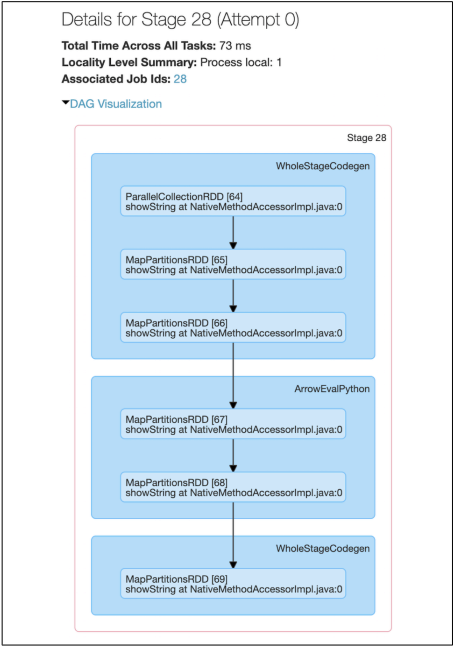

## Chapter 5. 스파크 SQL과 데이터 프레임: 외부 데이터 소스와 소통하기

### 작성자: 정현석(6기 빌더)

### 배울 내용 요약 

1. 아파치 하이브 및 아파치 스파크 모두에 대해 UDF를 사용한다.
2. JDBC 및 SQL 데이터베이스, PostgreSQL, MySQL, 태블로, 애저 코스모스 DB 및 MS SQL 서버와 같은 외부 데이터 원본과 연결한다.
3. 단순하거나 복잡한 유형, 고차 함수 그리고 일반적인 관계 연산자를 사용하여 작업한다.

<br>

### 1. 스파크 SQL과 아파치 하이브 

- 스파크 SQL의 이점
  - 더 빠른 성능 및 관계형 프로그래밍의 이점을 활용 가능
  - 복잡한 분석 라이브러리 호출 가능

<br>

- **사용자 정의 함수**
  - 자신의 기능을 정의할 수 있는 유연성을 제공하는 함수
- **스파크 SQL UDF**
  - UDF를 생성함으로써 사용자도 스파크 SQL 안에서 사용 가능
- **스파크 SQL에서 평가 순서 및 null 검사**
  - 적절한 null 검사 수행을 위해
      1. UDF 자체가 null을 인식하도록 만들고 UDF 내부에서 null 검사 수행
      2. IF 또는 CASE WHEN 식을 사용해 null 검사 수행 및 조건 분기에서 UDF 호출
- **판다스 UDF로 파이스파크 UDF 속도 향상 및 배포**
  - Pyspark UDF는 scala UDF보다 성능이 느리다는 문제로 Pandas UDF 도입
  - Pandas UDF는 아파치 애로우를 사용해 데이터를 전송하고 판다스는 해당 데이터로 작업
    - 아파치 스파크 3.0에서 판다스 UDF는 Pandas.Series 등 파이썬 유형 힌트로 판다스 UDF 유형을 유추
- 다음은 스파크 데이터 프레임에서 Pandas UDF를 실행하기 위한 스파크 UI 단계에 관한 그림

    

<br>

### 2. 스파크 SQL 셸, 비라인 및 태블로로 쿼리하기

- Spark SQL 쉘, Beeline CLI 유틸리티 및 태블로 및 Power BI와 같은 보고 도구를 포함하여 Apache Spark 쿼리하는 다양한 기술 존재

### 스파크 SQL 셸 사용하기

- Spark SQL CLS 시작하기

```shell
$SPARK_HOME/bin/spark-sql
```

<br>

### 비라인 작업

- **비라인 (beeline)**
  - SQLLine CLI 기반, hiveserver2에 접속하여 command shell을 수행할 수 있도록 도와주는 client
- **쓰리프트 서버 (Thrift)**
  - 스파크 프로그램에서 직접 쿼리를 실행할 수도 있지만, 쓰리프트 서버를 사용하여 원격지에서도 SQL 명령을 실행할 수 있도록 함

```shell
$SPARK_HOME/sbin/start-thriftserver.sh
```

<br>

- 비라인을 통해 쓰리프트 서버에 연결하기
  - 로컬 쓰리프트 서버에 연결
      - `!connect jdbc:hive2://localhost:10000`
      - username : `user@learningspark.org` | 비밀번호 : 비어 있음 (엔터키)

<br>

### 3. 외부 데이터 소스

- JDBC 및 SQL 데이터베이스부터 시작해 스파크 SQL을 사용하여 외부 데이터로 연결하는 방법에 대해 중점을 둠
- 자세한 방법은 해당 폴더의 파이썬 코드 참조

